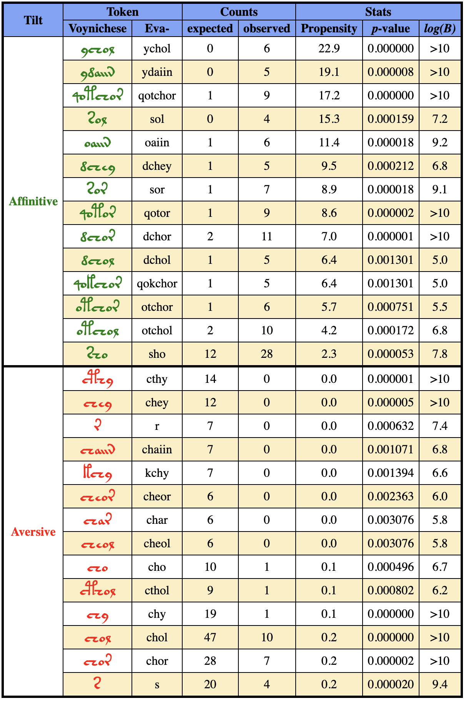
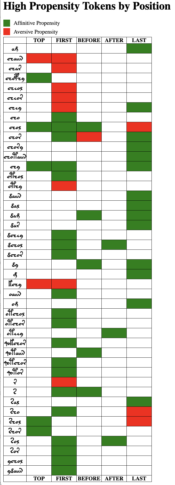

## Catalog of Tokens with Propensity for Various Positions

[Back to Table of Contents](README.md#Table-of-Contents)

<h3 align="center">Table SOM.1. Tokens with Propensity for Top Line of Paragraphs</h3>

<h3 align="center">Table SOM.2. Tokens with Propensity for First Position on a Line</h3>

<h3 align="center">Table SOM.3. Tokens with Propensity for Position Immediately Before a Drawing</h3>

<h3 align="center">Table SOM.4. Tokens with Propensity for Position Immediately After a Drawing</h3>

<h3 align="center">Table SOM.5. Tokens with Propensity Last Position on a Line</h3>

[Back to Table of Contents](README.md#Table-of-Contents)

