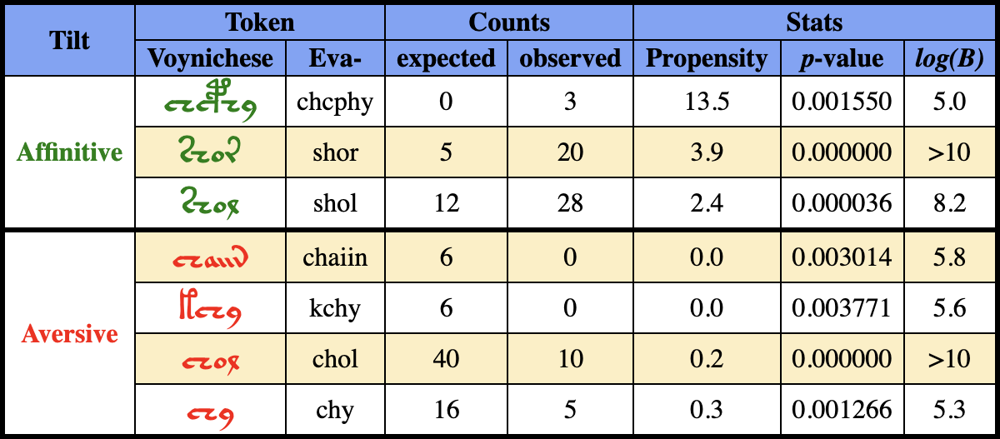
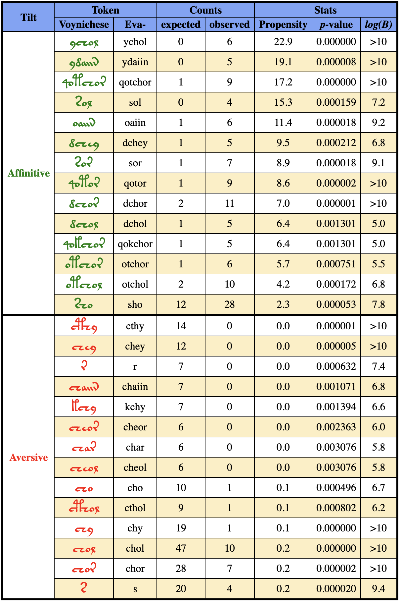
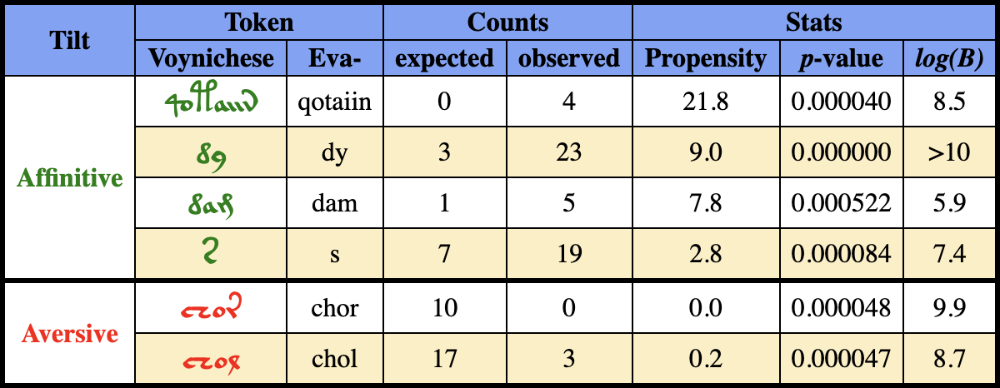
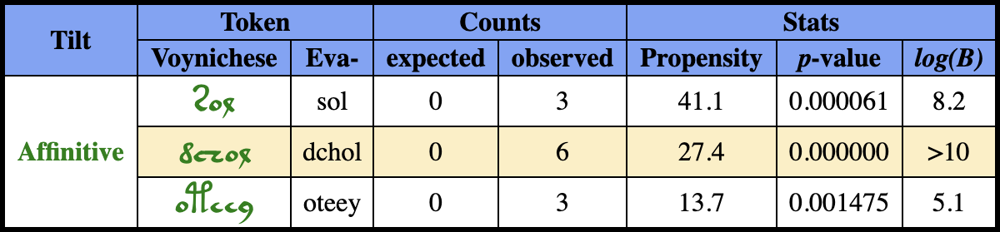
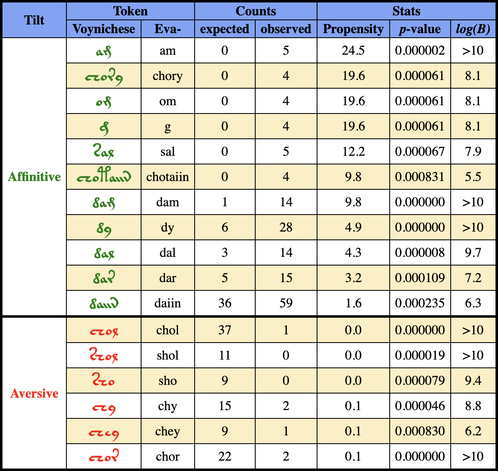

# Z01-SOM_Histocrypt_24
This site provides Supplemental Material for the 
research paper "Signs of Scribal Intent in the Voynich Manuscript".

The paper presents the results of a QuantumLynx Research study series exploring
the cryptic Voynich Manuscript. This particular study is the first for which 
formal results have been compiled for presentation (hence its reference name of Z01).
The study looked for signs of scribal intent hidden in overlooked features of the 
“Voynichese” script. The findings indicate that distributions of tokens within paragraphs 
vary significantly based on positions defined not only by elements intrinsic to the 
script such as paragraph and line boundaries but also by extrinsic elements, 
namely the hand-drawn illustrations of plants.

This supplemantal material includes a series of Jupyter Notebooks. These are:

* __Z01.1: Study Corpus for Study__
  * This notebook works through the preparation of a clean study corpus by 
 extraction of data from the transliterated the Voynich Manuscript.

* __# Z01.2: Token Cohorts__
  * This notebook sets up the several cohorts of tokens used for the study.
  
* __Z01.3: Token Length Analysis__
  * This notebook shows the calculations for the analysis of token length distributions for the different cohorts.

* __Z01.4: Token Propensities Analysis__
  * This notebook shows the calculations for the analysis of token usage propensities for each of the subject cohorts.

  
* __Z01.5: Extra Analyses__
    

# Additional Plots

<h3 align="center">Table 1. Tokens with Propensity for Top Line of Paragraphs</h3>

<h3 align="center">Table 2. Tokens with Propensity for First Position on a Line</h3>

<h3 align="center">Table 3. Tokens with Propensity for Position Immediately Before a Drawing</h3>

<h3 align="center">Table 4. Tokens with Propensity for Position Immediately After a Drawing</h3>

<h3 align="center">Table 5. Tokens with Propensity Last Position on a Line</h3>

